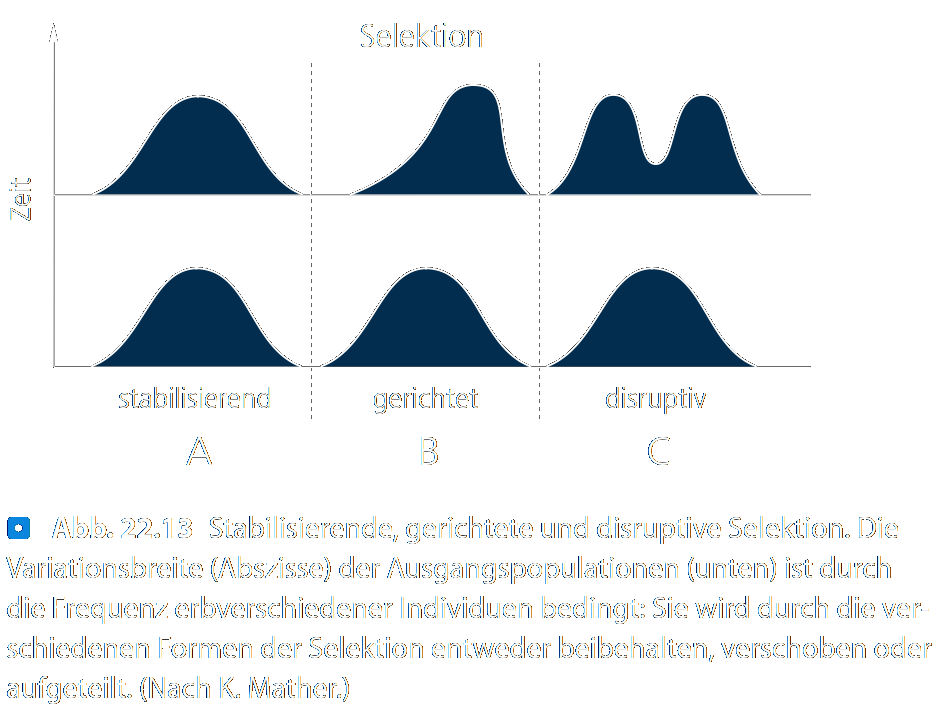
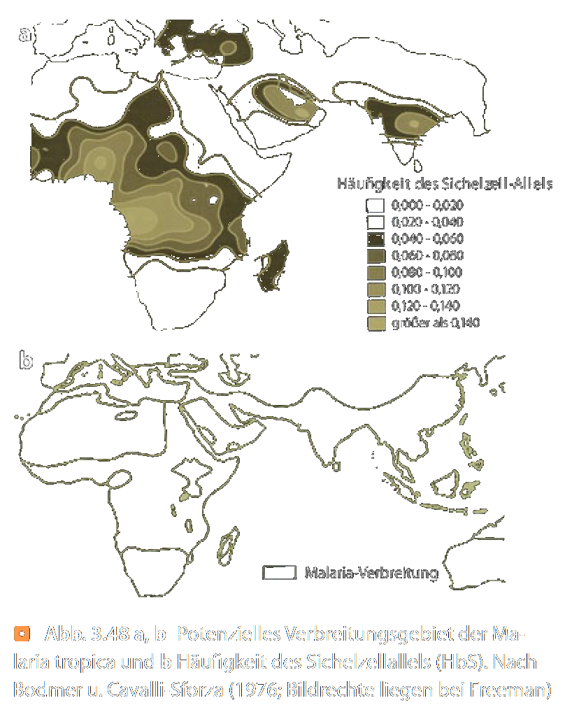

---?color=#005f6b
@snap[north span-100]
##### S Seminar 01
#### Vorlesung
@snapend
@snap[span-100]

@snapend
@snap[south span-100]
###### Michael Grünstäudl
###### 21. April 2020
@snapend

---?color=#005f6b
@snap[north-west span-100]
##### Foo bar Baz
@snapend

@snap[west span-100]
@ul[list-spaced-bullets text-08]
- Foo &#8594; Foo bar Baz
- Bar &#8594; Foo bar Baz
- &#8756; Foo bar Baz
- &#8756; Foo bar Baz
@ulend
@snapend

---?color=#005f6b
@snap[north-west span-100]
##### Formen der Selektion
@snapend

@snap[span-65]

@snapend

@snap[south span-100 text-04]
Quelle: Kadereit et al. 2014, Strasburger, 14. Auflage, Springer Verlag
@snapend

---?color=#005f6b
@snap[north-west span-100]
##### Gerichtete Selektion
@snapend

@snap[span-35]

@snapend

@snap[south span-100 text-04]
Quelle: Storch et al. 2007, Evolutionsbiologie, zweite Auflage, Springer Verlag
@snapend

---?color=#005f6b
@snap[north-west span-100]
##### Ausgleichende Selektion
@snapend

@snap[span-35]

@snapend

@snap[south span-100 text-04]
Quelle: Storch et al. 2007, Evolutionsbiologie, zweite Auflage, Springer Verlag
@snapend

---?color=#005f6b
@snap[north span-100]
##### S Seminar 01
#### Vorlesung
@snapend
@snap[span-100]

@snapend
@snap[south span-100]
###### Ende der Vorlesung
###### ~ ~ ~ ~ ~ ~ ~ ~ ~ ~
@snapend
