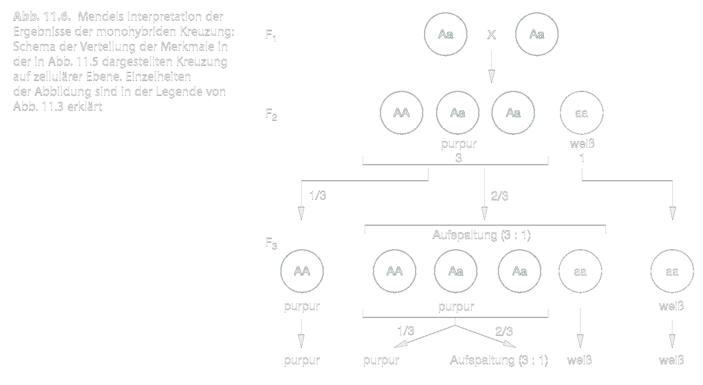

---?color=#005f6b
@snap[north span-100]
##### PI Praktikum 01
#### Vorlesung
@snapend
@snap[span-100]

@snapend
@snap[south span-100]
###### Michael Grünstäudl
###### 21./23. April 2020
@snapend

---?color=#005f6b
@snap[north-west span-50]
##### Vererbung der Mutationen
@snapend

@snap[west span-100]
@ul[list-spaced-bullets text-08]
- Mendelsche Regeln &#8594; Vererbung Mutationen
- Populationsgenetik &#8594; Verbreitung Mutationen
- &#8756; Verständnis Artbildung
- &#8756; Verständnis phylogenetische Diversifikation
@ulend
@snapend

---?color=#005f6b
@snap[north-west span-50]
##### Genotyp vs. Phänotyp
@snapend

@snap[west span-100]
@ul[list-spaced-bullets text-08]
- **Genotyp**: umfasst alle Gene des Genoms
- **Phänotyp**: Resultat der exprimierten Gene
- Wenn Mutation &#8594; Expression kann ausfallen
- Selektion am Phänotyp
@ulend
@snapend

---?color=#005f6b
@snap[north-west span-50]
##### Allele und Genotypen
@snapend

@snap[west span-100]
@ul[list-spaced-bullets text-08]
- Annahme: in Population kommen Allel *A* und seine mutierte Form *a* vor
- &#8756; in der Population Individuen mit Genotypen: *AA*, *Aa* und *aa*
- homozygot: *AA* und *aa*; heterozygot: *Aa*
- Weitere Annahme: *A* stellt ein Gen dar, dass für rote Blütenfarbe kodiert
- &#8756; heterozygote Individuen entweder intermediär rosa oder rot
@ulend
@snapend

---?color=#005f6b
@snap[north-west span-50]
##### Dominanz bei Allelen
@snapend

@snap[west span-100]
@ul[list-spaced-bullets text-08]
- Ausprägung von die Dominanz eines Alleles variiert
- Phänotyp der Heterozygoten liegt i.d.R. zwischen Homozygoten
- Jedoch: Die meisten Merkmale sind nicht disjunkt
- Wildtyp-Allel: Population am stärksten vertretene Allel
@ulend
@snapend

---?color=#005f6b
@snap[north-west span-50]
##### Mutation nicht gleichbedeutend mit neuem Phänotyp
@snapend

@snap[west span-100]
@ul[list-spaced-bullets text-08]
- Nucleotidsubstitution in Allel nicht zwingend Veränderung der Amniosäurensequenz
- stumme Mutationen
- Allelpolymorphismen makroskopisch nicht immer zu erkennen
- durch DNA-Sequenzanalyse erkennbar
@ulend
@snapend

---?color=#005f6b
@snap[north-west span-50]
##### Bedeutung der Arbeit von Mendel
@snapend

@snap[west span-100]
@ul[list-spaced-bullets text-08]
- Prinzip der Erbgänge von Gregor Mendel in Versuchen an Pflanzenhybriden erfasst
- Hauptuntersuchungsobjekt Erbse (*Pisum sativum*): zahlreiche durch Selbstbefruchtung homozygote Zuchtlinien
- Ergebnisse zum Zeitpunkt der Veröffentlichung (1865-1866) kaum gewürdigt
- Erst nach der Wiederentdeckung 1990  durch de Vries, Correns und Edler v. Tschermak-Seysenegg Bedeutung erkannt
@ulend
@snapend

---?color=#005f6b
@snap[north-west span-50]
##### Mendels' Experimente
@snapend

@snap[west span-100]
@ul[list-spaced-bullets text-08]
- Experimente an Gartenerbse veranlassten Mendel zur Postulierung von Gesetzmäßigkeiten (Mendelschen Regeln)
- Kreuzung unterschiedlicher Erbsensorten: z.B. glatte und runzelige Samen (Samenoberfläche), grünen und gelben Samen (Samenfarbe)
- zwei "Erbfaktoren"; heute: Allele eines Gens
@ulend
@snapend

---?color=#005f6b
@snap[north-west span-50]
##### Mendels' Experimente
@snapend

@snap[west span-100]

@snapend

@snap[west span-100]
@ul[list-spaced-bullets text-08]
- Erkenntnis: Werden zwei Individuen, die sich in nur einem Merkmal voneinander unterscheiden, als Parentalgeneration (P) miteinander gekreuzt, so resultiert eine im betrachteten Merkmal einheitliche erste Filialgeneration (F1) &#8594; 1. Mendelschen Regel (**Uniformitätsregel**)
@ulend
@snapend

---?color=#005f6b
@snap[north span-100]
##### PI Praktikum 01
#### Vorlesung
@snapend
@snap[span-100]

@snapend
@snap[south span-100]
###### Ende der Vorlesung
###### ~ ~ ~ ~ ~ ~ ~ ~ ~ ~
@snapend
