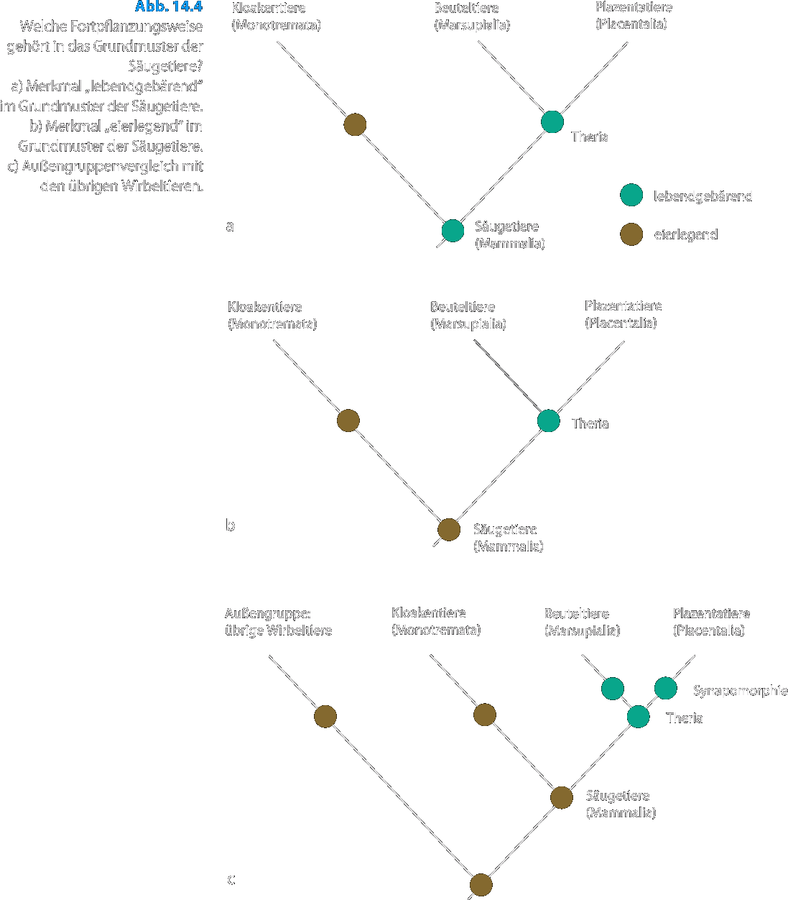
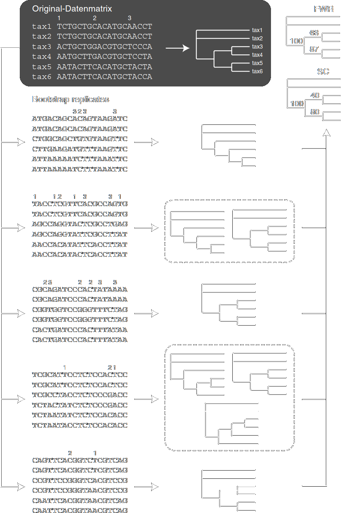
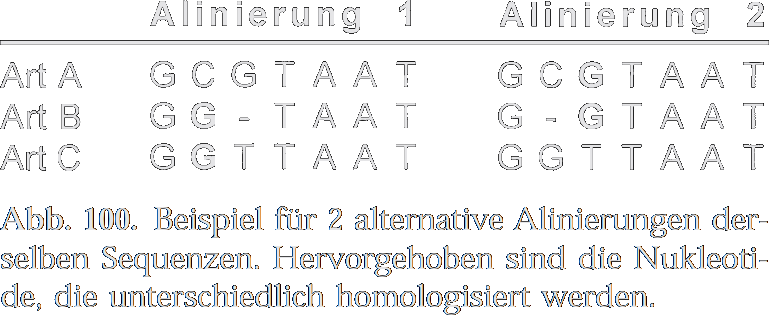
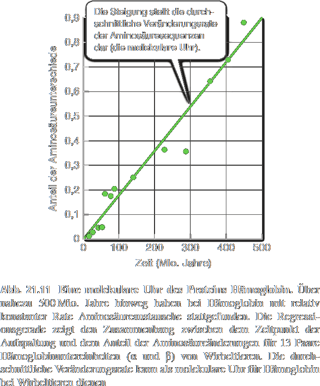
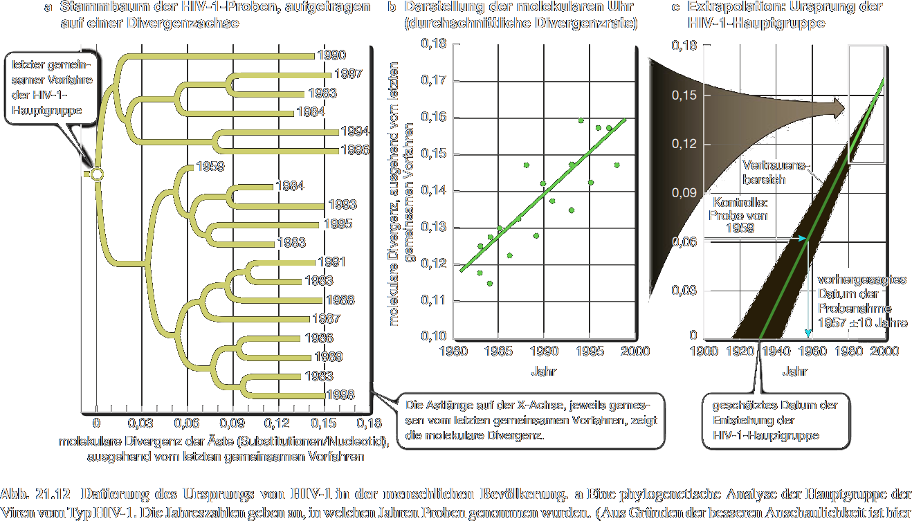

---?color=#005f6b
@snap[north span-100]
##### S Seminar 10
#### Vorlesung
@snapend
@snap[span-100]

@snapend
@snap[south span-100]
###### Michael Grünstäudl
###### 23. Juni 2020
@snapend

---?color=#005f6b
@snap[north-west span-100]
##### Aussagekraft von Stammbäumen
@snapend
@snap[west span-100]
@ul[list-spaced-bullets text-08]
- Stammbaumrekonstruktion versucht, einen historischen Prozess mit inkompletten Daten nachzuvollziehen
- Jedoch: genaue Evolutionsgeschichte nicht experimentell überprüfbar
- &#8756; Stammbaumrekonstruktion eine Hypothese, die es durch weitere Untersuchungen bestätigt, modifiziert oder widerlegt werden sollte
- Mit jedem Taxon oder Merkmal, welches man Datenmatrix zuführt, wird Datensatz kompletter und Stammbaumrekonstruktion verlässlicher
@ulend
@snapend

---?color=#005f6b
@snap[north-west span-100]
##### Wurzeln von Stammbäumen
@snapend
@snap[west span-100]
@ul[list-spaced-bullets text-08]
- Rekonstruktionsalgorithmen erstellen (meist) ungewurzelte Bäume (*unrooted trees*)
- ungewurzelte Stammbäume zeigen nur Kladogenese der Taxa, nicht Richtung der Merkmalsentwicklung (apomorph zu plesiomorph)
- Um Richtung von Merkmalsentwicklungen auf Stammbaum anzuzeigen, muss man Stammbaum wurzeln (*rooting of phylogenetic tree*)
- typischer Weg des rootings ist, eine Außengruppe (*outgroup*) einzubeziehen
@ulend
@snapend

---?color=#005f6b
@snap[north-west span-100]
##### Wurzeln von Stammbäumen
@snapend
@snap[west span-50]
@ul[list-spaced-bullets text-08]
- Als Außengruppe wählt man eine Gruppe, die mit Innengruppe einen nah verwandten gemeinsamen Vorfahren teilt, aber nicht der Innengruppe angehört
@ulend
@snapend
@snap[east span-50]

@snapend
@snap[south span-100 text-04]
Quelle: Waegele 2001: Grundlagen der phylogenetischen Systematik: Abb.50
@snapend

---?color=#005f6b
@snap[north-west span-100]
##### Wurzeln von Stammbäumen
@snapend
@snap[west span-50]
@ul[list-spaced-bullets text-08]
- Die Merkmalsausprägungen der Außengruppe lassen erkennen, welche Merkmalsausprägung in der Innengruppe wahrscheinlich plesiomorph und welche apomorph ist
@ulend
@snapend
@snap[east span-50]

@snapend
@snap[south span-100 text-04]
Quelle: Waegele 2001: Grundlagen der phylogenetischen Systematik: Abb.50
@snapend

---?color=#005f6b
@snap[north-west span-100]
##### Wurzeln von Stammbäumen
@snapend
@snap[west span-50]
@ul[list-spaced-bullets text-08]
- Jedes Merkmal, das sowohl bei der Innen- als auch bei der Außengruppe vorliegt, muss sich vor Entstehung der Innengruppe entwickelt haben und daher plesiomorph für die Innengruppe sein.
@ulend
@snapend
@snap[east span-50]

@snapend
@snap[south span-100 text-04]
Quelle: Waegele 2001: Grundlagen der phylogenetischen Systematik: Abb.50
@snapend

---?color=#005f6b
@snap[north-west span-100]
##### Wurzeln von Stammbäumen
@snapend
@snap[west span-100]
@ul[list-spaced-bullets text-08]
- Nach Berechnung des ungewurzelten Baums wird Wurzel zwischen die Unterbäume (also für Innengruppe und für Aussengruppe) eingefügt
- Letzte gemeinsame Vorfahre aller Taxa verbindet die beiden Unterbäume
- &#8756; Entwicklungsrichtung und die zeitliche Abfolge von Merkmalsveränderungen kann erkannt werden
@ulend
@snapend

---?color=#005f6b
@snap[north-west span-100]
##### Robustheit von Stammbäumen
@snapend
@snap[west span-70]
@ul[list-spaced-bullets text-08]
- Mehrere Methoden, um die Robustheit von Stammbäumen zu berechnen
- Beispiel: Das Entfernen einzelner Taxa, um die resultierende Veränderung der Topologie des Stammbaumes zu messen
@ulend
@snapend
@snap[east span-30]

@snapend
@snap[south span-100 text-04]
Quelle: Knoop und Müller 2009: Gene und Stammbäume: Seite 291
@snapend

---?color=#005f6b
@snap[north-west span-100]
##### Robustheit von Stammbäumen
@snapend
@snap[west span-70]
@ul[list-spaced-bullets text-08]
- Prozess des *bootstrapping* entfernt zufällig ausgewählte Taxa von einem Datensatz und dupliziert stattdessen andere Taxa (was die Dimensionen des Datensatzes erhält) &#8594; Stammbaumberechnung
- Prozess des bootstrapping wird häufig wiederholt, um eine große Anzahl von Stammbäumen (*bootstrap replicates*) zu erzeugen
@ulend
@snapend
@snap[east span-30]

@snapend
@snap[south span-100 text-04]
Quelle: Knoop und Müller 2009: Gene und Stammbäume: Seite 291
@snapend

---?color=#005f6b
@snap[north-west span-100]
##### Robustheit von Stammbäumen
@snapend
@snap[west span-70]
@ul[list-spaced-bullets text-08]
- Anschließend Zusammenfassung der Stammbaumrekonstruktion von Hunderten solcher bootstrap replicates, um Robustheit des eigentlichen Stammbaumes zu messen.
@ulend
@snapend
@snap[east span-30]

@snapend
@snap[south span-100 text-04]
Quelle: Knoop und Müller 2009: Gene und Stammbäume: Seite 291
@snapend

---?color=#005f6b
@snap[north-west span-100]
##### Robustheit von Stammbäumen
@snapend
@snap[west span-70]
@ul[list-spaced-bullets text-08]
- Beispiel: Je häufiger man in diesem Replicate-Pool ein bestimmtes Verzweigungsevent sieht, umso wahrscheinlicher ist dieses auch im auf allen Daten basierenden Stammbaum.
- Jedoch: Bootstrapping funktioniert nur, wenn der reduzierte Datensatz repräsentativ für die Gesamtheit aller Daten ist.
@ulend
@snapend
@snap[east span-30]

@snapend
@snap[south span-100 text-04]
Quelle: Knoop und Müller 2009: Gene und Stammbäume: Seite 291
@snapend

---?color=#005f6b
@snap[north-west span-100]
##### Homologie bei Nukleotiden
@snapend
@snap[west span-60]
@ul[list-spaced-bullets text-08]
- Homologe Merkmale: solche Merkmale, die von einem gemeinsamen Vorfahren geerbt wurden
- Homologie bei Nukleotiden erscheint paradox zu sein:
  - Werden DNA-Sequenzen identisch kopiert, sind diese Kopien in allen Details homolog.
  - Werden DNA-Sequenzen nicht identisch kopiert, können selbst gleiche Nukleotide analog sein, während ungleiche Nukleotide homolog sein können.
@ulend
@snapend
@snap[east span-40]

@snapend
@snap[south span-100 text-04]
Quelle: Waegele 2001: Grundlagen der phylogenetischen Systematik: Abb.100
@snapend

---?color=#005f6b
@snap[north-west span-100]
##### Homologie bei Nukleotiden
@snapend
@snap[west span-60]
@ul[list-spaced-bullets text-08]
- Homologie bei Nukleotiden erscheint paradox zu sein:
  - Sequenzen können auch nicht-homologe Zonen enthalten, die z.B. durch Verlust oder Insertion von Nukleotiden entstehen.
  - &#8756; Homologie muss für jedes Nukleotide einzeln evaluiert werden (*Positionshomologie*)
@ulend
@snapend
@snap[east span-40]

@snapend
@snap[south span-100 text-04]
Quelle: Waegele 2001: Grundlagen der phylogenetischen Systematik: Abb.100
@snapend

---?color=#005f6b
@snap[north-west span-100]
##### Positionshomologie und Alinierung
@snapend
@snap[west span-60]
@ul[list-spaced-bullets text-08]
- Homologie zwischen Sequenzen wird primär über Positionshomologie bestimmt
- geschieht mit Hilfe von Alinierungsverfahren, welche DNA-Sequenzen derart untereinander schreiben, dass mutmaßlich homologe Positionen in derselben Spalte stehen
@ulend
@snapend
@snap[east span-40]

@snapend
@snap[south span-100 text-04]
Quelle: Waegele 2001: Grundlagen der phylogenetischen Systematik: Abb.100
@snapend

---?color=#005f6b
@snap[north-west span-100]
##### Positionshomologie und Alinierung
@snapend
@snap[west span-60]
@ul[list-spaced-bullets text-08]
- DNA-Sequenzen können unterschiedlich lange sein
- &#8756; in kürzere Sequenzen müssen Lücken (*gaps*) eingefügt werden, damit alle homologen Nukleotide in Spalten untereinander stehen
@ulend
@snapend
@snap[east span-40]

@snapend
@snap[south span-100 text-04]
Quelle: Waegele 2001: Grundlagen der phylogenetischen Systematik: Abb.100
@snapend

---?color=#005f6b
@snap[north-west span-100]
##### Positionshomologie und Alinierung
@snapend
@snap[west span-60]
@ul[list-spaced-bullets text-08]
- Ergebnis einer Homologiebestimmung bei DNA-Sequenzen ist die Alinierung dieser Sequenzen
- Alinierung ist einer der entscheidenden Schritte in der Stammbaumrekonstruktion, denn alternative Alinierungen desselben Datensatzes können großen Einfluss auf das Ergebnis der Verwandtschaftsanalyse habe
@ulend
@snapend
@snap[east span-40]

@snapend
@snap[south span-100 text-04]
Quelle: Waegele 2001: Grundlagen der phylogenetischen Systematik: Abb.100
@snapend

---?color=#005f6b
@snap[north-west span-100]
##### Molekulare Uhr
@snapend
@snap[west span-60]
@ul[list-spaced-bullets text-08]
- Mit Hilfe von molekularen Uhren kann der Zeitpunkt für einzelne Kladogenesen abgeschätzt werden
- Grundannahme: Rate molekularer Veränderungen sei konstant genug, um daraus die Zeitpunkte der Kladogenesen in einem Stammbaum ableiten zu können (Hypothese von Zuckerkandl und Pauling aus 1965)
@ulend
@snapend
@snap[east span-40]

@snapend
@snap[south span-100 text-04]
Quelle: Sadava et al. 2019: Purves Biologie: Abb.21.11
@snapend

---?color=#005f6b
@snap[north-west span-100]
##### Molekulare Uhr
@snapend
@snap[west span-60]
@ul[list-spaced-bullets text-08]
- Abhängig von der Mutationsrate verändern sich verschiedene Gene mit unterschiedlicher Geschwindigkeit
- Mutationsraten sind selten konstant zwischen unterschiedlichen organismischen Linien oder Genen
- Mutationsraten spiegeln vor allem unterschiedliche Generationszeiten, Selektionsdruck, DNA-Reparatursysteme wider
@ulend
@snapend
@snap[east span-40]

@snapend
@snap[south span-100 text-04]
Quelle: Sadava et al. 2019: Purves Biologie: Abb.21.11
@snapend

---?color=#005f6b
@snap[north-west span-100]
##### Molekulare Uhr
@snapend
@snap[west span-60]
@ul[list-spaced-bullets text-08]
- Jedoch: Bei nah verwandten Arten evolvieren Gene mit ähnlicher Funktion i.d.R. mit relativ konstanter Mutationsrate
- Es gilt:
  - Anzahl der Mutationen in einem Gen direkt proportional mit Anzahl an DNA-Replikationen dieses Gens
  - Anzahl der DNA-Replikationen direkt proportional zur verstichenen Zeit
  - &#8756; Durchschnittliche Rate, mit der sich Mutationen akkumuliert haben, indikativ für die verstrichene Zeit
@ulend
@snapend
@snap[east span-40]

@snapend
@snap[south span-100 text-04]
Quelle: Sadava et al. 2019: Purves Biologie: Abb.21.11
@snapend

---?color=#005f6b
@snap[north-west span-100]
##### Molekulare Uhr
@snapend
@snap[west span-60]
@ul[list-spaced-bullets text-08]
- Jedoch: Ohne zusätzliche Information gibt die molekulare Uhr nur relative Altersunterschiede zwischen betrachteten Taxa, aber keine absoluten Altersinformationen
@ulend
@snapend
@snap[east span-40]

@snapend
@snap[south span-100 text-04]
Quelle: Sadava et al. 2019: Purves Biologie: Abb.21.11
@snapend

---?color=#005f6b
@snap[north-west span-100]
##### Fossilien und Divergence Dating
@snapend
@snap[east span-100]

@snapend
@snap[south span-100 text-04]
Quelle: Sadava et al. 2019: Purves Biologie: Abb.21.12
@snapend

---?color=#005f6b
@snap[north-west span-100]
##### Fossilien und Divergence Dating
@snapend
@snap[west span-100]
@ul[list-spaced-bullets text-08]
- Um absolute Altersangaben mit Hilfe von molekularen Uhren zu erhalten, muss man diese mittels Fossilbelegen oder geologischen Daten kalibrieren.
- Bei der Kalibrierung werden bestimmte Kladogenese-Events mit Zeiten versehen und das Alter weiterer Events auf dem Stammbaum extrapoliert &#8594; *divergence dating*
@ulend
@snapend

---?color=#005f6b
@snap[north-west span-100]
##### Fossilien und Divergence Dating
@snapend
@snap[west span-100]
@ul[list-spaced-bullets text-08]
- Genauigkeit der extrapolierten Werte hängt stark von der Konstanz der Mutationsraten ab
- Jede Altersabschätzung mittels molekularer Uhr ist eigentlich ein Altersintervall (Konfidenzintervall):
  - Intervall wird umso größer, je weiter man im Stammbaum von den Kalibrierungspunkten entfernt ist
@ulend
@snapend

---?color=#005f6b
@snap[north-west span-100]
##### Fossilien und Divergence Dating
@snapend
@snap[west span-100]
@ul[list-spaced-bullets text-08]
- Mit Hilfe von kalibrierten molekularen Uhren war es möglich, zeitlichen Verlauf vieler Krankheiten zu rekonstrukieren
- Beispiel: gemeinsamer Vorfahre aller bekannten HIV-1-Viren existierte etwa 1930 &#8594; HIV-1 Stamm existierte bereits mindestens ein halbes Jahrhundert vor seinem Auftreten als globale Pandemie in der afrikanischen Bevölkerung
@ulend
@snapend

---?color=#005f6b
@snap[north-west span-100]
##### Fossilien und Divergence Dating
@snapend
@snap[east span-100]

@snapend
@snap[south span-100 text-04]
Quelle: Sadava et al. 2019: Purves Biologie: Abb.21.12
@snapend

---?color=#005f6b
@snap[north span-100]
##### S Seminar 09
#### Vorlesung
@snapend
@snap[span-100]

@snapend
@snap[south span-100]
###### Ende der Vorlesung
###### ~ ~ ~ ~ ~ ~ ~ ~ ~ ~
@snapend
