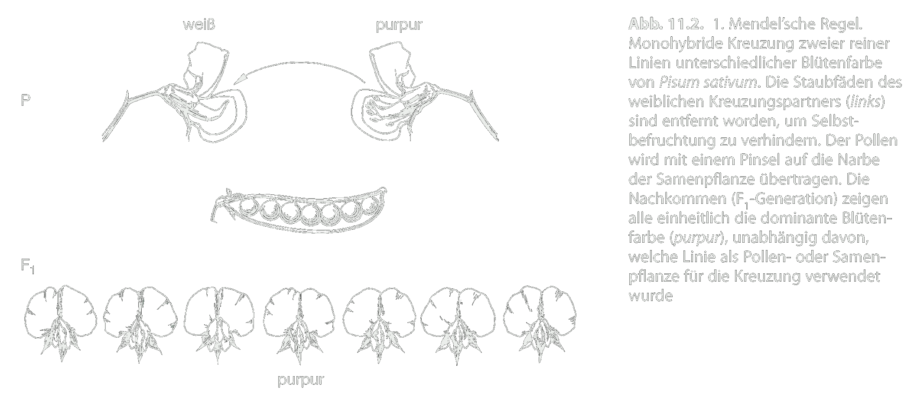
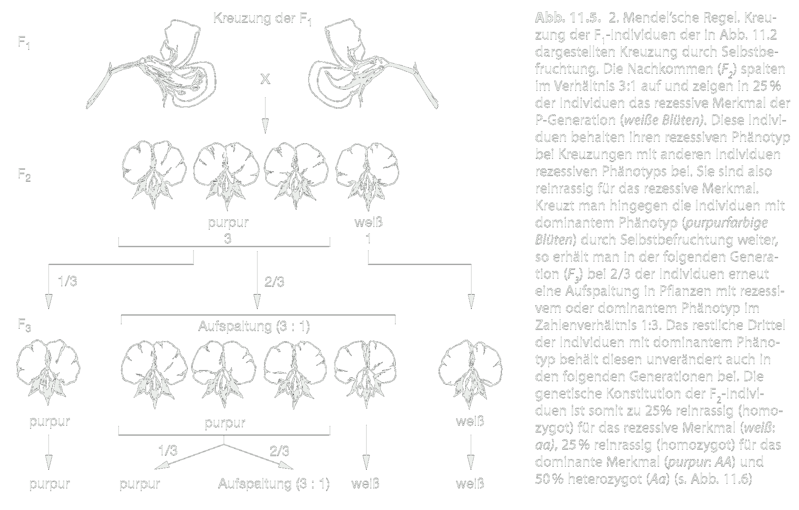
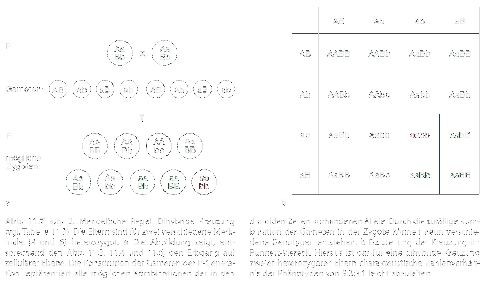

---?color=#005f6b
@snap[north span-100]
##### PI Praktikum 01
#### Vorlesung
@snapend
@snap[span-100]

@snapend
@snap[south span-100]
###### Michael Grünstäudl
###### 21./23. April 2020
@snapend

---?color=#005f6b
@snap[north-west span-100]
##### Vererbung der Mutationen
@snapend

@snap[west span-100]
@ul[list-spaced-bullets text-08]
- Mendelsche Regeln &#8594; Vererbung Mutationen
- Populationsgenetik &#8594; Verbreitung Mutationen
- &#8756; Verständnis Artbildung
- &#8756; Verständnis phylogenetische Diversifikation
@ulend
@snapend

---?color=#005f6b
@snap[north-west span-100]
##### Genotyp vs. Phänotyp
@snapend

@snap[west span-100]
@ul[list-spaced-bullets text-08]
- **Genotyp**: umfasst alle Gene des Genoms
- **Phänotyp**: Resultat der exprimierten Gene
- Wenn Mutation &#8594; Expression kann ausfallen
- Selektion am Phänotyp
@ulend
@snapend

---?color=#005f6b
@snap[north-west span-100]
##### Allele und Genotypen
@snapend

@snap[west span-100]
@ul[list-spaced-bullets text-08]
- Annahme: in Population kommen Allel *A* und seine mutierte Form *a* vor
- &#8756; in der Population Individuen mit Genotypen: *AA*, *Aa* und *aa*
- homozygot: *AA* und *aa*; heterozygot: *Aa*
- Weitere Annahme: *A* stellt ein Gen dar, dass für rote Blütenfarbe kodiert
- &#8756; heterozygote Individuen entweder intermediär rosa oder rot
@ulend
@snapend

---?color=#005f6b
@snap[north-west span-100]
##### Dominanz bei Allelen
@snapend

@snap[west span-100]
@ul[list-spaced-bullets text-08]
- Ausprägung von die Dominanz eines Alleles variiert
- Phänotyp der Heterozygoten liegt i.d.R. zwischen Homozygoten
- Jedoch: Die meisten Merkmale sind nicht disjunkt
- Wildtyp-Allel: Population am stärksten vertretene Allel
@ulend
@snapend

---?color=#005f6b
@snap[north-west span-100]
##### Mutation nicht gleichbedeutend mit neuem Phänotyp
@snapend

@snap[west span-100]
@ul[list-spaced-bullets text-08]
- Nucleotidsubstitution in Allel nicht zwingend Veränderung der Amniosäurensequenz
- stumme Mutationen
- Allelpolymorphismen makroskopisch nicht immer zu erkennen
- durch DNA-Sequenzanalyse erkennbar
@ulend
@snapend

---?color=#005f6b
@snap[north-west span-100]
##### Bedeutung der Arbeit von Mendel
@snapend

@snap[west span-100]
@ul[list-spaced-bullets text-08]
- Prinzip der Erbgänge von Gregor Mendel in Versuchen an Pflanzenhybriden erfasst
- Hauptuntersuchungsobjekt Erbse (*Pisum sativum*): zahlreiche durch Selbstbefruchtung homozygote Zuchtlinien
- Ergebnisse zum Zeitpunkt der Veröffentlichung (1865-1866) kaum gewürdigt
- Erst nach der Wiederentdeckung 1990  durch de Vries, Correns und Edler v. Tschermak-Seysenegg Bedeutung erkannt
@ulend
@snapend

---?color=#005f6b
@snap[north-west span-100]
##### Mendels' Experimente
@snapend

@snap[west span-100]
@ul[list-spaced-bullets text-08]
- Experimente an Gartenerbse veranlassten Mendel zur Postulierung von Gesetzmäßigkeiten (Mendelschen Regeln)
- Kreuzung unterschiedlicher Erbsensorten: z.B. glatte und runzelige Samen (Samenoberfläche), grünen und gelben Samen (Samenfarbe)
- zwei "Erbfaktoren"; heute: Allele eines Gens
@ulend
@snapend

---?color=#005f6b
@snap[north-west span-100]
##### Mendels' Experimente
@snapend

@snap[west span-100]

@snapend

@snap[south span-100 text-04]
Quelle: Storch et al. 2007, Evolutionsbiologie, zweite Auflage, Springer Verlag
@snapend

---?color=#005f6b
@snap[north-west span-100]
##### Mendels' Erkenntnisse
@snapend

@snap[west span-100]
@ul[list-spaced-bullets text-07]
- Erkenntnis: Werden zwei Individuen, die sich in nur einem Merkmal voneinander unterscheiden, als Parentalgeneration (P) miteinander gekreuzt, so resultiert eine im betrachteten Merkmal einheitliche erste Filialgeneration (F1) &#8594; 1. Mendelschen Regel (**Uniformitätsregel**)
- Erkenntnis: Folgt das Allel dem Schema Dominanz/Rezessivität und sind die Eltern homozygot, zeigt die F1-Generation die selbe Ausprägung wie der Elternteil mit dem dominanten Allel. &#8594; 1. Mendelschen Regel (**U
- Erkenntnis: Werden zwei Individuen der F1-Generation miteinander gekreuzt, so resultiert eine zweite Filialgeneration (F2), in der Individuen mit unterschiedlichen Phänotypen im Zahlenverhältnis 1:2:1 auftreten. &#8594; 2. Mendelschen Regel (**Spaltungsregel**)
@ulend
@snapend

---?color=#005f6b
@snap[north-west span-100]
##### Mendelsche Vererbungsregeln
@snapend

@snap[west span-100]
@ul[list-spaced-bullets text-08]
- Mendelschen Vererbungsregeln erklären die relativen Häufigkeit der Genotypen bei Nachkommen von Eltern, deren Genotyp genau definiert ist
- Annahmen: 3 Genotypen *AA*, *Aa* und *aa*, wobei *A* dominant und *a* rezessiv ist
- Es lassen sich drei Regeln ableiten:
  - Uniformitätsregel (1. Mendelsche Regel)
  - Spaltungsregel (2. Mendelsche Regel)
  - Unabhängigkeitsregel (3. Mendelsche Regel)
@ulend
@snapend

---?color=#005f6b
@snap[north-west span-100]
##### Uniformitätsregel
@snapend

@snap[west span-100]

@snapend

@snap[south span-100 text-04]
Quelle: Storch et al. 2007, Evolutionsbiologie, zweite Auflage, Springer Verlag
@snapend

---?color=#005f6b
@snap[north-west span-100]
##### Spaltungsregel
@snapend

@snap[west span-100]

@snapend

@snap[south span-100 text-04]
Quelle: Storch et al. 2007, Evolutionsbiologie, zweite Auflage, Springer Verlag
@snapend

---?color=#005f6b
@snap[north-west span-100]
##### Unabhängigkeitsregel
@snapend

@snap[west span-100]

@snapend

@snap[south span-100 text-04]
Quelle: Storch et al. 2007, Evolutionsbiologie, zweite Auflage, Springer Verlag
@snapend

---?color=#005f6b
@snap[north-west span-100]
##### Erbfaktoren sind partikulär
@snapend

@snap[west span-100]
@ul[list-spaced-bullets text-08]
- Auftreten elterlicher Geno- und Phänotypen in der F2-Generation &#8594; Erbfaktoren partikulär
- Fortschritt gegenüber Darwins Vorstellungen von Vererbung
- denn Darwins Sichtweise nicht mit seiner eigenen Evolutionstheorie kongruent
@ulend
@snapend

---?color=#005f6b
@snap[north-west span-100]
##### Genetische Kopplung
@snapend

@snap[west span-100]
@ul[list-spaced-bullets text-08]
- in Unabhängigkeitsregel beschriebene freie Kombinierbarkeit der Erbanlagen in empirischen Daten selten zu finden
- übermäßig häufig jene Genotypen, die schon an den Elternpflanzen zu beobachteten sind
- bei Vererbung segregieren einige Gene/Allele nicht unabhängig voneinander
- Erstellung von Kopplungskarten
@ulend
@snapend

---?color=#005f6b
@snap[north-west span-100]
##### Allel- und Genotyphäufigkeiten
@snapend

@snap[west span-100]
@ul[list-spaced-bullets text-08]
- Berechnung von relativen Allel- und Genotyphäufigkeiten
- Genmodell mit einem Locus und zwei Allelen &#8594; Grundlagen der Populationsgenetik ableiten
- Zwei Kenngrößen:
  - relative Allel-Häufigkeit
  - relative Genotypen-Häufigkeit
@ulend
@snapend

---?color=#005f6b
@snap[north-west span-100]
##### Berechnung Genotyphäufigkeit
@snapend

@snap[west span-100]
@ul[list-spaced-bullets text-08]
- Modellpopulation mit Allelen *A* und *a* werden z.B. folgende Genotypen beobachtet: *aa*, *Aa*, *AA*, *Aa*, *AA*, *aa*, *AA*, *Aa*
- Berechnung: relativen Genotypenhäufigkeiten P (für *AA*), Q (für *Aa*) und R (für *aa*)
- P + Q + R = 1.0
@ulend
@snapend

---?color=#005f6b
@snap[north-west span-100]
##### Berechnung Allelhäufigkeit
@snapend

@snap[west span-100]
@ul[list-spaced-bullets text-08]
- Ableitung von Allelhäufigkeit aus relativen Genotypenhäufigkeiten
- p = P + 1/2Q und q = R + 1/2Q
- Berechnung: relativen Allelhäufigkeiten p (für *A*) und q (für *a*)
- p + q = 1.0
@ulend
@snapend

---?color=#005f6b
@snap[north-west span-100]
##### Hardy-Weinberg-Gesetz - Idee
@snapend

@snap[west span-100]
@ul[list-spaced-bullets text-08]
- Kennt man Häufigkeit der Genotypen und Allele in einer Population &#8594; wie entwickeln sich diese Parameter in nachfolgenden Populationen
- Vorhersage schwierig, denn Auftreten natürlicher Selektion
- Jedoch: Falls in großer Population Paarungen zufällig verlaufen und keine Selektion gegen einen Genotyp auftritt &#8594; Hardy-Weinberg-Gleichgewicht
- &#8756; Man kann Relation zwischen der relativen Genotypen- und Allelhäufigkeit bestimmen
@ulend
@snapend

---?color=#005f6b
@snap[north-west span-100]
##### Hardy-Weinberg-Gesetz - Voraussetzungen
@snapend

@snap[west span-100]
@ul[list-spaced-bullets text-08]
- große Population, so daß Probenfehler- und Zufallseffekte keine Bedeutung
- Partnerwahl erfolgt vollkommen zufällig
- Alle Genotypen sind gleich lebensfähig und fertil
- keine Mutation, keine Migration und keine Gendrift
@ulend
@snapend

---?color=#005f6b
@snap[north-west span-100]
##### Hardy-Weinberg-Gesetz - Aussagen
@snapend

@snap[west span-100]
@ul[list-spaced-bullets text-08]
- Vorhersage der Allelfrequenz über die Genotypfrequenz
- Wenn HWG, dann Allel- und Genotypfrequenzen über Generationen konstant
- Alle Genotypen sind gleich lebensfähig und fertil
- Wenn Partnerwahl vollkommen zufällig &#8594; HWG bereits nach einer Generation
- Fähigkeit die Frequenz der Heterozygoten zu berechnen
@ulend
@snapend

---?color=#005f6b
@snap[north-west span-100]
##### Bruch des Hardy-Weinberg-Gesetzes
@snapend

@snap[west span-100]
@ul[list-spaced-bullets text-08]
- Ist Population nicht in Hardy-Weinberg-Gleichgewicht:
  - Auftreten natürliche Selektion
  - Auftreten gerichteter Paarung
  - sehr kleine Populationsgröße &#8594; stochastische Effekte
- Interessante für Populationsgenetik
- Warum bleiben gewisse genetische Varianten in der Population erhalten während andere verschwinden
@ulend
@snapend

---?color=#005f6b
@snap[north span-100]
##### PI Praktikum 01
#### Vorlesung
@snapend
@snap[span-100]

@snapend
@snap[south span-100]
###### Ende der Vorlesung
###### ~ ~ ~ ~ ~ ~ ~ ~ ~ ~
@snapend
