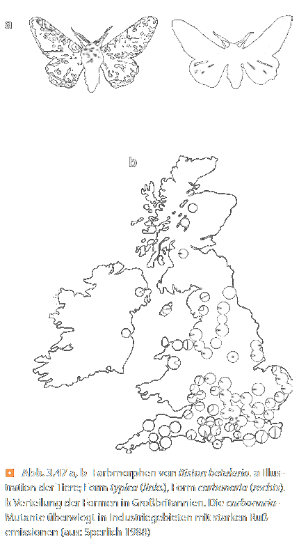

---?color=#005f6b
@snap[north span-100]
##### S Seminar 01
#### Vorlesung
@snapend
@snap[span-100]

@snapend
@snap[south span-100]
###### Michael Grünstäudl
###### 21. April 2020
@snapend

---?color=#005f6b
@snap[north-west span-100]
##### Genetische Variabilität
@snapend

@snap[west span-100]
@ul[list-spaced-bullets text-08]
- Entsteht durch:
  - *Mutation*
  - Durchmischung des Erbguts unterschiedlicher Individuen via *Rekombination*
- Bei Eukaryoten: Rekombination ist Teil bzw. Zweck der sexuellen Reproduktion
- Bei Prokaryoten: Keine oder "parasexuelle" Reproduktion &#8594; geringere genetische Durchmischung im selben Zeitraum
@ulend
@snapend

---?color=#005f6b
@snap[north-west span-100]
##### Sexuelle Reproduktion bei Eukaryoten
@snapend

@snap[west span-100]
@ul[list-spaced-bullets text-08]
- Rekombination des elterlichen Erbguts bewirkt durch:
  - unabhängige Verteilung der Chromosomen auf Gameten
  - Crossing-Over während Meiose
  - zufällige Gametenfusion bei Befruchtung (Syngamie)
- Hauptziel der Rekombination: Erzeugung genetischer Variabilität
@ulend
@snapend

---?color=#005f6b
@snap[north-west span-100]
##### Sexuelle Reproduktion bei Prokaryoten
@snapend

@snap[west span-100]
@ul[list-spaced-bullets text-08]
- Austauschs von Erbinformation unterschiedlicher "Individuen" (Konzept richtig?) durch:
  - direkten zellulären Kontakt (Konjugation)
  - Übertragung über Bakteriophagen (Transduktion)
  - Übertragung freier DNA (Transformation)
- Da keine sexuelle Reproduktion *sensu stricto*: "Parasexuelle Reproduktion"
@ulend
@snapend

---?color=#005f6b
@snap[north-west span-100]
##### Mendelschen Regeln und Rekombination
@snapend

@snap[west span-100]
@ul[list-spaced-bullets text-08]
- Mendelschen Regeln basieren auf Prinzipien der genetische Rekombination:
  - Uniformität der F1-Generation: betrachtete Organismus diploid, sodass jedes Chromosom (und daher auch jedes Gen) zweifach vorliegt &#8594; Nachkommenschaft homozygoter Eltern kann daher nur heterozygot sein
  - Segregation während der F2-Generation: während Meiose findet Halbierung der Chromosomenzahl statt &#8594; Gameten haben nur ein Allel &#8594; Gameten fusionieren während der Syngamie zufällig
  - Freie Kombinierbarkeit der Erbanlagen: während Meiose I sind die Bivalente randomiesiert orientiert &#8594; Verteilung auf Tochterzellen stochastisch
@ulend
@snapend

---?color=#005f6b
@snap[north-west span-100]
##### Genetische Kopplung und Rekombination
@snapend

@snap[west span-100]
@ul[list-spaced-bullets text-08]
- Korrelation zwischen Wahrscheinlichkeit für Kopplung unterschiedlicher Gene auf Chromosom und Entfernung dieser Gene voneinander auf Chromosom
- Große Entfernung zwischen beobachteten Genen führt zu häufiger Trennung, da Wahrscheinlichkeit für Crossing-Over groß
- Nähe am Chromosom korreliert:
  - indirekt proportional mit Wahrscheinlichkeit für Crossing-Over
  - direkt proportional mit Wahrscheinlichkeit für genetische Kopplung
@ulend
@snapend

---?color=#005f6b
@snap[north-west span-100]
##### Generation genetischer Variabilität
@snapend

@snap[west span-100]
@ul[list-spaced-bullets text-08]
- Rekombination kann ist die Hauptquelle für genetischer Variabilität bei Eukaryoten
- Rekombination kann in nur einer Generation zur Entstehung einer großen Zahl neuer Genotypen führen
- Beispiel:
  - Bei nur fünf Genen mit je vier Allelen ergeben sich zwischen F1- und F2-Generation 100.000 Kombinationen
  - Jedoch: Empirisch ist Zahl niedriger, da nicht alle Gene frei kombiniert werden können (sondern teilweise gekoppelt sind)
@ulend
@snapend

---?color=#005f6b
@snap[north-west span-100]
##### Grundsätzliches zur Selektion - Teil I
@snapend

@snap[west span-100]
@ul[list-spaced-bullets text-08]
- Evolution findet auf Basis von natürlicher Selektion durch Umweltfaktoren statt
- Charles Darwin: "On the origin of species *by means of natural selection*"
- Selektion greift nicht an einzelnen Genen (Genotyp; Gen-Selektion) sondern am ganzen Organismus (Phänotyp; Individualselektion)
- Natürliche Selektion: Überleben **nicht zwangsläufig** des Stärkstens, sondern desjenigen mit größtem Fortpflanzungserfolg
- &#8597; Einfluss der natürlichen Selektion auf Population nur über viele Generationen hinweg (mindestens zwei) sichtbar
@ulend
@snapend

---?color=#005f6b
@snap[north-west span-100]
##### Grundsätzliches zur Selektion - Teil II
@snapend

@snap[west span-100]
@ul[list-spaced-bullets text-08]
- Selektion kann nur wirken, wenn genetische Variabilität existiert
- Wirkung natürlicher Selektion auf genetischer Variabilität führt zur Veränderung des Erbguts aufeinanderfolgender Generationen &#8594; Entstehung neuer Arten
- Phänotypischen Plastizität relevant, aber genetische Variabilität für Evolution deutlich wichtiger
@ulend
@snapend

---?color=#005f6b
@snap[north-west span-100]
##### Relevanz von Mutationen
@snapend

@snap[west span-100]
@ul[list-spaced-bullets text-08]
- Mutation: spontane (oder experimentell induzierte) Veränderung des Erbguts
- Unterschiedliche Formen der Mutation:
  - Veränderung der DNA-Sequenz in einem Gen
  - Veränderung der Struktur der Chromosomen
  - Neukombination ganzer Genome
- Für alle Mutation gilt: Auftreten zufällig bzw. stochastisch
- Für Evolution nur Mutationen relevant die in Keimzellen auftreten
@ulend
@snapend

---?color=#005f6b
@snap[north-west span-100]
##### Formen der Selektion
@snapend

@snap[span-70]

@snapend

@snap[south span-100 text-04]
Quelle: Kadereit et al. 2014, Strasburger, 14. Auflage, Springer Verlag
@snapend

---?color=#005f6b
@snap[north-west span-100]
##### Gerichtete Selektion
@snapend

@snap[span-35]

@snapend

@snap[south span-100 text-04]
Quelle: Storch et al. 2007, Evolutionsbiologie, zweite Auflage, Springer Verlag
@snapend

---?color=#005f6b
@snap[north-west span-100]
##### Ausgleichende Selektion
@snapend

@snap[span-45]

@snapend

@snap[south span-100 text-04]
Quelle: Storch et al. 2007, Evolutionsbiologie, zweite Auflage, Springer Verlag
@snapend

---?color=#005f6b
@snap[north span-100]
##### S Seminar 01
#### Vorlesung
@snapend
@snap[span-100]

@snapend
@snap[south span-100]
###### Ende der Vorlesung
###### ~ ~ ~ ~ ~ ~ ~ ~ ~ ~
@snapend
