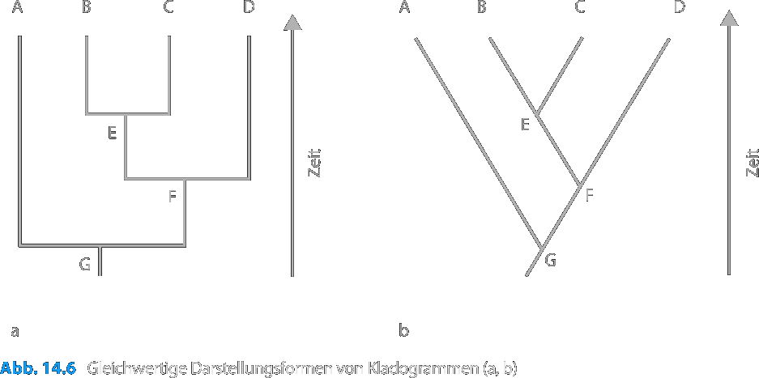
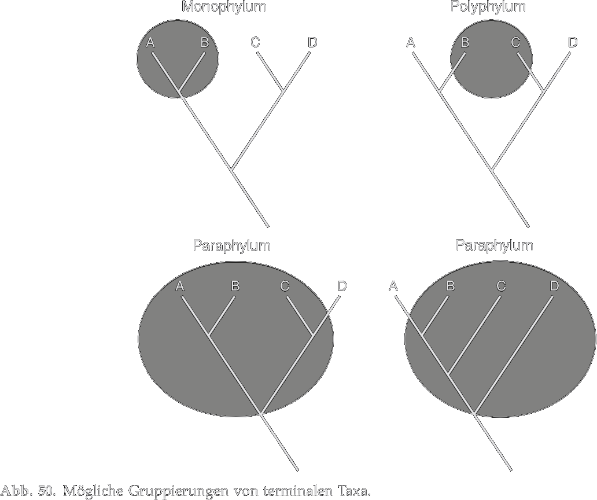
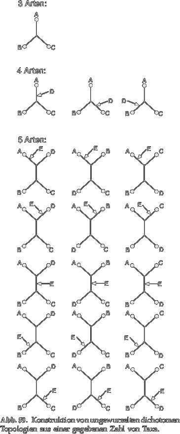
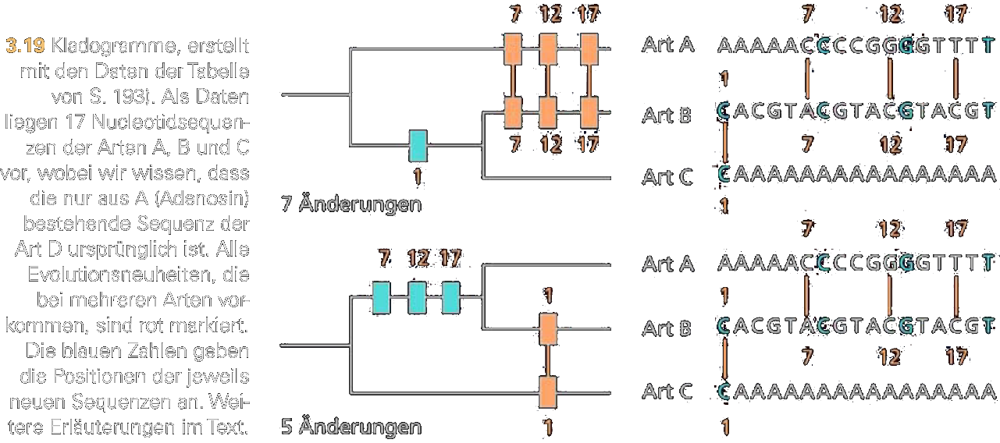
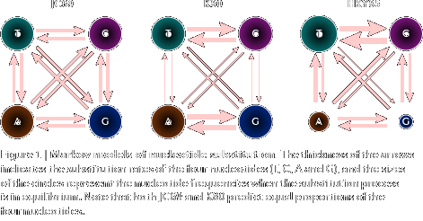

---?color=#005f6b
@snap[north span-100]
##### Seminar 
#### Phylogenetische Systematik - Teil 1
@snapend
@snap[span-100]

@snapend
@snap[south span-100]
###### Sommersemester 2021
###### Michael Grünstäudl
@snapend

---?color=#005f6b
@snap[north-west span-100]
##### Kladistische Methode
@snapend
@snap[west span-100]
@ul[list-spaced-bullets text-08]
- wurde durch den Entomologen Willi Hennig formalisiert
- Konzentration auf den Verlauf der Verzweigungen in einem Stammbaum (Kladogenese)
- ausschließlich *homologe Merkmale* für Rekonstruktion von Verzweigungen
- unter diesen homologen Merkmalen sucht man nach *Apomorphien* für Gruppe
- aus Kladistik entwickelte sich phylogenetische Systematik
@ulend
@snapend

---?color=#005f6b
@snap[north-west span-100]
##### Phylogenetische Systematik
@snapend
@snap[west span-100]
@ul[list-spaced-bullets text-08]
- Fokus dieser Art der Systematik liegt auf Stammbaum-Verzweigungen (Kladogenese)
- nicht/wenig berücksichtigt wird die Entwicklung innerhalb eine Linie (Anagenese)
@ulend
@snap[span-50]

@snapend
@snapend
@snap[south span-100 text-04]
Quelle: Dreesmann et al. 2011: Evolutionsbiologie - Moderne Themen für den Unterricht: Abb.14.6

---?color=#005f6b
@snap[north-west span-100]
##### Phylogenetische Systematik
@snapend
@snap[west span-100]
@ul[list-spaced-bullets text-08]
- Unterteilung der Organismen in Paare von Schwesternarten, welche durch gemeinsame Apomorphien (*Synapomorphien*) identifiziert sind
- jedes Schwesterarten-Paar besitzt gemeinsamen Vorfahren, bei welchem die Apomorphie das erste Mal auftrat
@ulend
@snap[span-50]

@snapend
@snapend
@snap[south span-100 text-04]
Quelle: Dreesmann et al. 2011: Evolutionsbiologie - Moderne Themen für den Unterricht: Abb.14.6

---?color=#005f6b
@snap[north-west span-100]
##### Phylogenetische Systematik
@snapend
@snap[west span-100]
@ul[list-spaced-bullets text-08]
- Endergebnis ist ein ineinander gegliedertes System von Schwestergruppen-Paaren (Kladogramm)
- unterschiedliche Darstellungsformen möglich bei gleichem Informationsgehalt
@ulend
@snap[span-50]

@snapend
@snapend
@snap[south span-100 text-04]
Quelle: Dreesmann et al. 2011: Evolutionsbiologie - Moderne Themen für den Unterricht: Abb.14.6

---?color=#005f6b
@snap[north-west span-100]
##### Schwesterarten
@snapend
@snap[west span-100]
@ul[list-spaced-bullets text-08]
- Jeder Verzweigungspunkt in einem Kladogramm stellt eine Art dar, die
  - in der Vergangenheit real existierte, und
  - sich in zwei Schwesterarten aufgespalten hat
- neue Arten entstehen nur dann, wenn sich Stammart in zwei Schwesterarten auftrennt (Dichotomie)
@ulend
@snap[span-50]

@snapend
@snapend
@snap[south span-100 text-04]
Quelle: Dreesmann et al. 2011: Evolutionsbiologie - Moderne Themen für den Unterricht: Abb.14.6

---?color=#005f6b
@snap[north-west span-100]
##### Kladogram vs. Phylogramm
@snapend
@snap[west span-100]
@ul[list-spaced-bullets text-08]
- *Klado*gramm:
  - die Verzweigungspunkte indizieren das Auftreten von Apomorphien
  - diese Apomorphien werden in den aus dem Verzweigungspunkt entstehenden Taxa zu Synapomorphien (gemeinsame abgeleitete Merkmale)
  - die Astlänge hat keine Bedeutung, da nur die Kladogenese (aber nicht die Anagenese) dargestellt wird
@ulend
@snapend

---?color=#005f6b
@snap[north-west span-100]
##### Kladogram vs. Phylogramm
@snapend
@snap[west span-100]
@ul[list-spaced-bullets text-08]
- *Phylo*gramm:
  - erweiterte Version eines Kladogramms, da hier die Länge der Äste die Anagenese darstellt
  - die Länge der Äste ist proportional zur Anzahl der Synapomorphien
  - die Astlänge drückt also die Divergenz der Taxa aus
- Das Phylogramm enthält also sowohl Information zur Kladogene wie auch zur Anagenese.  
@ulend
@snapend

---?color=#005f6b
@snap[north-west span-50]
##### Monophylie
@snapend
@snap[west span-50]
@ul[list-spaced-bullets text-08]
- Endergebnis der phylogenetischen Systematik ist ein ineinander gegliedertes System von Stammarten und deren Nachkommen &#8594; eine *monophyletische* Gruppe
- Ein Kladogramm/Phylogramm begründet die Monophylie der dargestellten Gruppen über die zugrundeliegenden Synapomorphien
@ulend
@snapend
@snap[east span-50]

@snapend
@snap[south span-100 text-04]
Quelle: Waegele 2001: Grundlagen der phylogenetischen Systematik: Abb.50
@snapend

---?color=#005f6b
@snap[north-west span-100]
##### Monophylie
@snapend
@snap[west span-50]
@ul[list-spaced-bullets text-08]
- Ein Kladogramm/Phylogramm begründet die Monophylie der dargestellten Gruppen über die zugrundeliegenden Synapomorphien
@ulend
@snapend
@snap[east span-50]

@snapend
@snap[south span-100 text-04]
Quelle: Waegele 2001: Grundlagen der phylogenetischen Systematik: Abb.50
@snapend

---?color=#005f6b
@snap[north-west span-100]
##### Monophylie, Paraphylie, Polyphylie
@snapend
@snap[west span-50]
@ul[list-spaced-bullets text-08]
- phylogenetischen Systematik erkennt nur monophyletische Gruppen als Basis für eine Klassifizierung an
  - *Paraphyletische* Gruppen
  - *Polyphyletische* Gruppen
@ulend
@snapend
@snap[east span-50]

@snapend
@snap[south span-100 text-04]
Quelle: Waegele 2001: Grundlagen der phylogenetischen Systematik: Abb.50
@snapend

---?color=#005f6b
@snap[north-west span-100]
##### Paraphyletische Gruppen
@snapend
@snap[west span-50]
@ul[list-spaced-bullets text-08]
- Gruppen von Organismen, die nur Abkömmlinge einer Stammart, aber nicht alle Nachkommen dieser Stammart enthalten
@ulend
@snapend
@snap[east span-50]

@snapend
@snap[south span-100 text-04]
Quelle: Waegele 2001: Grundlagen der phylogenetischen Systematik: Abb.50
@snapend

---?color=#005f6b
@snap[north-west span-100]
##### Polyphyletische Gruppen
@snapend
@snap[west span-50]
@ul[list-spaced-bullets text-08]
- Gruppen von Organismen, die auf unterschiedliche Stammarten zurückgehen
@ulend
@snapend
@snap[east span-50]

@snapend
@snap[south span-100 text-04]
Quelle: Waegele 2001: Grundlagen der phylogenetischen Systematik: Abb.50
@snapend

---?color=#005f6b
@snap[north-west span-100]
##### Monophylie, Paraphylie, Polyphylie
@snapend
@snap[west span-50]
@ul[list-spaced-bullets text-08]
- phylogenetische Systematik versucht Verwendung von para- und polyphyletischen Gruppen entgegenzuwirken &#8594; werden durch monophyletische Gruppierungen ersetzt
@ulend
@snapend
@snap[east span-50]

@snapend
@snap[south span-100 text-04]
Quelle: Waegele 2001: Grundlagen der phylogenetischen Systematik: Abb.50
@snapend

---?color=#005f6b
@snap[north-west span-100]
##### Innen- und Außengruppe
@snapend
@snap[west span-50]
@ul[list-spaced-bullets text-08]
- *Innengruppe*: jene Organismen, deren Verwandtschaftsbeziehungen untersucht werden sollen
- Um zu unterscheiden, welche Merkmalszustände ursprünglich (plesiomorph) und welche als abgeleitet (apomorph) sind: Vergleich der Innengruppe mit einer Außengruppe
@ulend
@snapend
@snap[east span-50]

@snapend
@snap[south span-100 text-04]
Quelle: Dreesmann et al. 2011: Evolutionsbiologie - Moderne Themen für den Unterricht: Abb.14.4
@snapend

---?color=#005f6b
@snap[north-west span-100]
##### Innen- und Außengruppe
@snapend
@snap[west span-50]
@ul[list-spaced-bullets text-08]
- *Außengruppe*: teilt mit der Innengruppe einen nah verwandten gemeinsamen Vorfahren aber gehört nicht der Innengruppe an
@ulend
@snapend
@snap[east span-50]

@snapend
@snap[south span-100 text-04]
Quelle: Dreesmann et al. 2011: Evolutionsbiologie - Moderne Themen für den Unterricht: Abb.14.4
@snapend

---?color=#005f6b
@snap[north-west span-100]
##### Molekulare phylogenetische Systematik
@snapend
@snap[west span-100]
@ul[list-spaced-bullets text-08]
- Molekulare Daten sind heutzutage die am häufigsten verwendeten Daten für phylogenetische Systematik
- Genom eines Organismus enthält Fülle von Merkmalen für die phylogenetische Analyse: Nukleotid-Sequenzen der DNA oder Aminosäure-Sequenzen von Proteinen
- Sequenzen von Nukleotiden oder Aminosäuren werden genutzt, um Stammbäume zu erstellen
- Ähnlichkeit zwischen Sequenzen unterschiedlicher Taxa wird über ein multiples Sequenzalignment bestimmt
@ulend
@snapend

---?color=#005f6b
@snap[north-west span-100]
##### Stammbaumrekonstruktion der molekularen phylogenetischen Systematik
@snapend
@snap[west span-100]
@ul[list-spaced-bullets text-08]
- Unterschiedliche Methoden der Stammbaumrekonstruktion an molekularen Daten
- Allen diesen Methoden gemeinsam:
  - Wie findet man jenen Stammbaum, der Ähnlichkeiten im Sequenzalignment in optimaler Weise erklärt, obwohl Anzahl möglicher Stammbäume extrem hoch?
  - Sequenzen von Nukleotiden oder Aminosäuren werden genutzt, um Stammbäume zu erstellen und evolutionäre Beziehungen zwischen den Arten zu identifizieren
  - Ähnlichkeit zwischen Sequenzen unterschiedlicher Taxa wird über ein multiples Sequenzalignment bestimmt
@ulend
@snapend

---?color=#005f6b
@snap[north-west span-100]
##### Stammbaumrekonstruktion der molekularen phylogenetischen Systematik
@snapend
@snap[west span-50]
@ul[list-spaced-bullets text-08]
- Beispiel: um optimalen Stammbaum für nur zehn verwandte Sequenzen zu finden, müssen ca. zwei Millionen theoretisch möglichen Bäumen untersucht werden (bei Ignorieren von Astlängen)
@ulend
@snapend
@snap[east span-30]

@snapend
@snap[south span-100 text-04]
Quelle: Waegele 2001: Grundlagen der phylogenetischen Systematik: Abb.59
@snapend

---?color=#005f6b
@snap[north-west span-100]
##### Parsimonie-Prinzip
@snapend
@snap[west span-100]
@ul[list-spaced-bullets text-08]
- Parsimonie-Prinzip (Sparsamkeits-Prinzip) wird auch in molekulare phylogenetische Systematik verwendet
- Grundidee ist, dass evolutive Szenarien umso wahrscheinlicher sind, je weniger einzelne Änderungsschritte die jeweilige Stammbaumhypothese erfordert
@ulend
@snap[center span-50]

@snapend
@snapend
@snap[south span-100 text-04]
Quelle: Burda and Begall 2004: Evolution - Ein Lese-Lehrbuch: Abb. 3.19
@snapend

---?color=#005f6b
@snap[north-west span-100]
##### Parsimonie-Prinzip
@snapend
@snap[west span-100]
@ul[list-spaced-bullets text-08]
- Jedoch: algorithmische Implementierung des Parsimonie-Prinzips oft zu langsam für molekularen Daten
@ulend
@snap[center span-50]

@snapend
@snapend
@snap[south span-100 text-04]
Quelle: Burda and Begall 2004: Evolution - Ein Lese-Lehrbuch: Abb. 3.19
@snapend

---?color=#005f6b
@snap[north-west span-100]
##### Distanz-Methoden
@snapend
@snap[west span-100]
@ul[list-spaced-bullets text-08]
- Verwendung mathematischer Modelle für die evolutionäre Veränderung von DNA-Sequenzen
- solche Modelle modellieren u.a. die unterschiedlichen Geschwindigkeiten des Austauschs von Nukleotiden oder mehrfache Änderungen einer Nukleotidsequenz an der gleichen Alignment-Position
@ulend
@snap[center span-50]

@snapend
@snapend
@snap[south span-100 text-04]
Quelle: Yang and Rannala (2012)
@snapend

---?color=#005f6b
@snap[north-west span-100]
##### Distanz-Methoden
@snapend
@snap[west span-100]
@ul[list-spaced-bullets text-08]
- bekanntesten Distanz-Methoden für die molekulare phylogenetische Systematik sind:
  - Neighbour Joining (abgekürzt NJ)
  - Maximum Likelihood (abgekürzt ML)
@ulend
@snap[center span-50]

@snapend
@snapend
@snap[south span-100 text-04]
Quelle: Yang and Rannala (2012)
@snapend

---?color=#005f6b
@snap[north-west span-100]
##### Neighbour Joining
@snapend
@snap[west span-100]
@ul[list-spaced-bullets text-08]
- produziert für eine gegebene Sequenzmenge nur einen Baum
- ist schneller, ungenauer und kann größere Sequenzmengen verarbeiten als ML
- beruht auf dem Prinzip der minimalen Evolution und sucht den kleinsten Baum, der die Unterschiede erklärt, die im multiplen Sequenzalignment sichtbar werden
@ulend
@snapend

---?color=#005f6b
@snap[north-west span-100]
##### Maximum Likelihood
@snapend
@snap[west span-100]
@ul[list-spaced-bullets text-08]
- erstellt viele, unterschiedlich wahrscheinliche Bäume und liefert damit eine andere Qualität
- stößt aber mit wachsender Sequenzmenge schneller an die Grenzen der Rechenleistung
- ermittelt jene Stammbäume, welche gemäß der angenommenen Nukleotide-Sequenz-Modelle am ehesten zum multiplen Sequenzalignment passen
- erfordert i.d.R. einen hohen Rechenaufwand
@ulend
@snapend

---?color=#005f6b
@snap[north span-100]
##### Seminar 
#### Phylogenetische Systematik - Teil 1
@snapend
@snap[span-100]

@snapend
@snap[south span-100]
###### Ende der Vorlesung
###### ~ ~ ~ ~ ~ ~ ~ ~ ~ ~
@snapend
